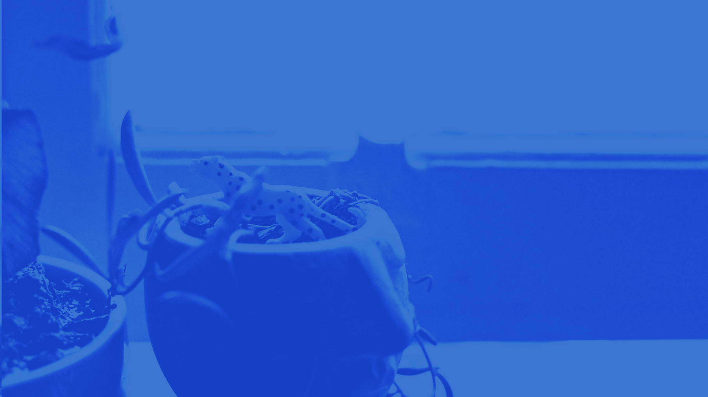

With “quarantine” being the defining word of 2020, most of us spent more time than ever staring at our computer screens, phones and various devices. I know, for one, I have.

About 3 months ago, I really started wondering about the effect of all this extra screen time on our mental health. The big companies on the other side of the screen like Facebook, Twitter and Pinterest have unlimited resources to make their products as compelling (“addictive”) as possible. But what happens when we, as users, have so few alternatives in terms of how to spend our time — as it’s often felt during quarantine?
The Netflix documentary “The Social Dilemma” really puts into perspective our modern relationship with social media. These companies are quite literally fighting for our attention. Between that — and phones being probably the most prolific device on our planet — what’s that really doing to us? The film goes into detail as to the overall effects on society (10/10 would recommend) and, as stated in its conclusion, maintains a sense of hope that these companies have the potential to change in the future. In the meantime, however, let’s talk about what we can do to change as individuals.

Really, it’s all about embracing (or developing) a growth mentality. Though we often feel stuck, we aren’t forced to remain victims of our situation, slaves to our devices, or accepting of “the way it is”. If we want to reassert control over our thoughts, we just need a bit of knowledge on how the brain works, and a couple techniques to retrain it to work better for us.
My main three points (which I’ll tie together) come from talks by Mel Robbins and Jim Kwik, as well as the “Better Than Yesterday” YouTube channel(I will include links at the end, definitely worth a watch).

First, let’s talk about dopamine — the so-called “pleasure molecule” in your brain. It’s actually more than that; really, it deals with your desires. Activities that release high levels of dopamine will motivate you more towards them over activities that release lower levels of dopamine. How does your brain choose the amount to release? Well, it’s based on your brain’s immediate perception of reward. Fast food is a perfect example: we know we’ll enjoy eating a bunch of junk food, so it leads to a higher level release of dopamine. We therefore tend to reach for fast food rather than a healthier option.

You can see how your brain sets its priorities with this logic. It leads you towards things that release high levels of dopamine, like playing video games and watching TV, over low-release activities like studying or reading books. This low-level release makes you feel less motivated to do the activity, especially when there’s a high level option nearby. There’s a reason why you find yourself mindlessly beginning to type “youtube” into your search browser when you should be studying.

What else releases high levels of dopamine in your brain? Well, most addictive substances release very high levels of dopamine and (again) a high level of dopamine release will motivate an individual towards that action. This is, in part, how addiction works.

Everything, however, releases dopamine and activities like video games or browsing the internet, for example, lead to high levels. So guess what? So does your phone. And the various apps you have on it. This isn’t a secret — all the big tech companies have done their homework when it comes to the psychological aspects of social media. They know how your brain works and they design their products to exploit it. We act in a way to get a high level of dopamine release in anticipation for a reward, right? Well how often do you check your phone to see if you’ve got a notification?

Back to the brain chemistry side of things. Our body likes to maintain homeostasis — a constant environment. Our body temperature stays within a certain range; if it goes out of that, we’re most likely sick. Our body likes consistency; it wants to maintain a constant level. But what happens when we put our body out of the range to which it’s grown accustomed? Well, we start developing a tolerance. This can be seen with heavy drinkers. You start drinking so much that your body develops a tolerance and that becomes your new normal. The same concept can be applied to dopamine levels. Once your brain gets used to high levels of dopamine, it will start down regulating your dopamine receptors (by decreasing the number of receptors on cells). This rewiring of your brain will lead to what’s called “dopamine tolerance”. Now your brain will want to maintain being in this state of constant high dopamine levels.

You thought it was hard to be motivated to do activities tied to low dopamine release before. Well, now homeostasis wants to maintain this environment of high dopamine in the brain. You start to feel little to no motivation for tasks that release low level amounts of dopamine because your brain wants to live in a high dopamine state. This is one of the reasons why drug addicts have such a hard time returning to a normal life. They want to be in this state of high dopamine. Real life can’t compare.

While the dangers of drug addiction are well-documented, we all have phones — and we’re using them all day long. Our phones, with some help from the other screens in our lives, are constantly putting us in this high state of dopamine. Think about how often you want to check your phone when studying. Or how about when you’re at work or talking to someone? Your brain is trying to maintain homeostasis for a high dopamine level environment. It wants that hit from checking your phone. Start to see the problem?

The good news is that nothing is set in stone. Just as detoxing can help reset your alcohol tolerance (among many other health benefits), the same can be done for dopamine. What does a dopamine detox entail? Well, first and foremost, you try to avoid activities that release high levels of dopamine: the internet, phones, and screens in general. And you do this for at least a couple hours a day. You will be bored, but that’s good. Embrace the boredom. Get so bored that stuff you found boring becomes enjoyable again. You’re rewiring your brain, resetting the priorities. Try to connect the dopamine release we crave to things that are good for us (like exercise). And, if cutting out high dopamine activities is too hard, then structure your day in such a way that the reward is the high level dopamine activity. Study for 2 hours then watch tv for half an hour. Follow a low level activity with a high one.

Next, let’s look at our brain states as described by Jim Kwik. We have a few. There’s our beta state (which is the normal one as we go about our days awake), Delta (which is when we’re fast asleep), and we have Theta. Theta is the state we’re in when fluctuating in and out of consciousness right before we fall asleep. This is when our mind starts to drift off and when we often start coming up with ideas. Explains shower thoughts, doesn’t it? And ever notice that the answer to the problem you couldn’t solve all day can just pop into your head as you’re falling asleep? That’s the theta state.

Lastly, we have alpha state. It’s the state known as “relaxed awareness”. We set aside our critical mind and just absorb. An example of the alpha state that we can all relate to is watching television. Think about how engrossed you become while watching tv. Someone can try to strike up a conversation with you and you’ll barely respond. You just let out a “uh-huh”, hardly processing what they’ve said.

Knowing this, think about the role that your phone plays in your life. How insistent the desire has become for you to check it throughout the day. Screens are designed to give that high level of dopamine and put our brains in that alpha state gluing us to them. And when you’re opening your phone first thing in the morning or last thing before you fall asleep, you’re wasting that creative theta state. We allow our phones to distract us, training our brain to be reactive to the intended products instead of our own desires.

How to combat this? Simple, with meditation. Meditation doesn’t need to be this monumental task. You don’t need to dedicate hours of your day to reach some “zen” state. Think of it as a simple mental exercise and treat your brain like a muscle. One of the best (and simplest) ways is to just have a mantra or phrase. Close your eyes and imagine that phrase every time your mind starts to drift away. Repeat the phrase and bring your thoughts back to the forefront of your mind. Then repeat that phrase again every time your mind drifts. It’s a great exercise to help stop being so easily distracted. You’ll become more aware of when and how you begin to drift, and you’ll have a tool to help bring your attention back to its intended focus. Mindfulness is important. When you can have control over your mind you won’t be as inattentive when people talk to you; you can put yourself in that alpha state to learn instead; you will be less distracted and think more critically.

Lastly, we have visualization and this comes from Mel Robbins. In our brains, we have something called the reticular activating system. This is the usual network of neurons, but it’s function is to work as a filter. This filter lets in certain information into your brain and blocks others out. And who told it what to filter? We did. All our experiences and memories program it.

But how does this work in practice? Well, it takes in information from our life and experiences — from the conversations we had to what we read on our facebook feeds. Your brain would be overwhelmed if it tried to process all that information and treat it with equal weight. So this filter comes and takes in what it deems relevant based on your past experience and habits. This is why we have what is called a “confirmation bias”; we like to read what we agree with. It is a bit of a double- edged sword, however. For example, if we have low self esteem, the reticular activating system will go through your day and look for evidence to reaffirm that feeling.

But if that’s the case, let’s change it! Here’s where visualization comes in.

Visualization is a two step process. First, close your eyes and picture the person you want to be. Imagine yourself being more confident, speaking up at work, going to the gym, taking care of yourself. Visualize what your life will look like when you’ve accomplished that.

Second, associate that picture with the positive emotions that you’ll feel when you’ve attained that alternative self-image. Visualize feeling proud that you’re going to the gym, feeling grateful for taking care of yourself, feeling happy you spoke up at work. Marry your picture with an emotion.

The cool thing about the reticular activating system is that our brain can’t really distinguish between real memories and ones we’re imagining. With enough visualizing we can essentially encode a memory and reprogram this filter. If we think we’re failures based on poor performance in high school, well, let’s start visualizing ourselves feeling proud for learning a new subject instead. With practice (and by repeating this process), our filter will stop trying to find evidence in our day of us as failures and start looking for evidence to reaffirm our ability to learn.

In this way, visualizing will help build your skills. The more you see yourself as a confident person (and feel proud of being a confident person), the more that will manifest in reality. You can change your filter to stop looking for reasons to stay quiet and instead to look for opportunities to speak up. Get your filter to reaffirm the person you want to be and get rid of that imposter syndrome.

Lately, it seems like everything is designed to put us in this reactive state. You wake up, check your phone, get some bad news and that’s it for you day — day ruined. But that’s not life. Life isn’t about being a slave to our devices, or to our insecurities and anxieties. So why always be stuck in this reactive state? We can use the same information that tech companies use to exploit our mental weakness and instead use it to promote better mental health.

At the end of this, if nothing else, I hope you’re a bit more aware of how your brain works. Ideally, you now have a few new tools in your toolbelt to help. The dopamine detox will help reset your dopamine receptors and should improve motivation. Meditation is a great cognitive exercise to increase your concentration and mindfulness. Visualization will help reprogram your reticular activating system to let you be the person you want to be and not the other way around. Be who you want to be and don’t let self doubt (or worse, screens!) stop you.

It all takes practice. None of this can change overnight. But when you put effort into recognizing your behavioral patterns and actively challenge them, real change is possible.

Let’s end with one of my favorite analogies from Jim Kwik, who says “be a thermostat, not a thermometer”. What does a thermometer do? It reacts to the environment and that’s it. It’s all it can do. The happiest people in the world are those that feel in control of their own happiness and their lives. So be a thermostat, because what does a thermostat do? It sets the temperature, it sets the goals. The environment rises to it.

Edited by: Michael Wynands

References/Videos I recommend:

Better than yesterday:

https://www.youtube.com/watch?v=9QiE-M1LrZk&ab_channel=BetterThanYesterday

Jim Kwik:

https://www.youtube.com/watch?v=REeROakzwfU&list=PLqGiQIV0lCBJYatoO93FpsdeW3lgb-zuf&index=9&ab_channel=BeInspired

Mel Robbins

https://www.youtube.com/watch?v=2iPFtZENEq4&ab_channel=BeInspired

Other References:

https://www.psychologytoday.com/intl/blog/the-athletes-way/201405/the-neuroscience-pleasure-and-addiction

https://www.ncbi.nlm.nih.gov/pmc/articles/PMC2791340/

https://www.cell.com/cell/fulltext/00...

https://www.centersite.net/poc/view_doc.php?type=doc&id=48370&cn=1408